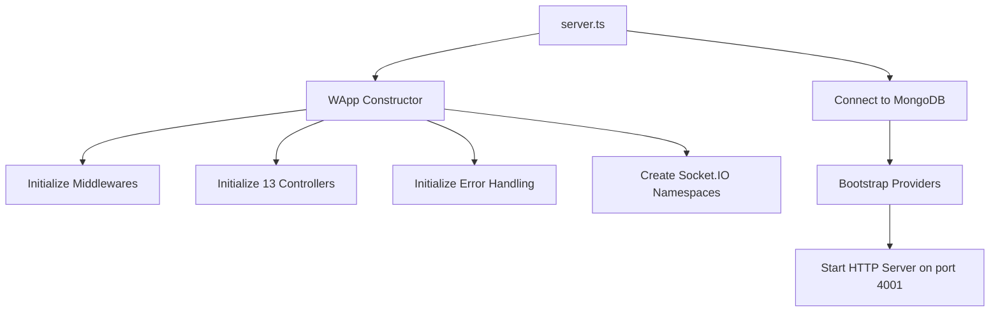
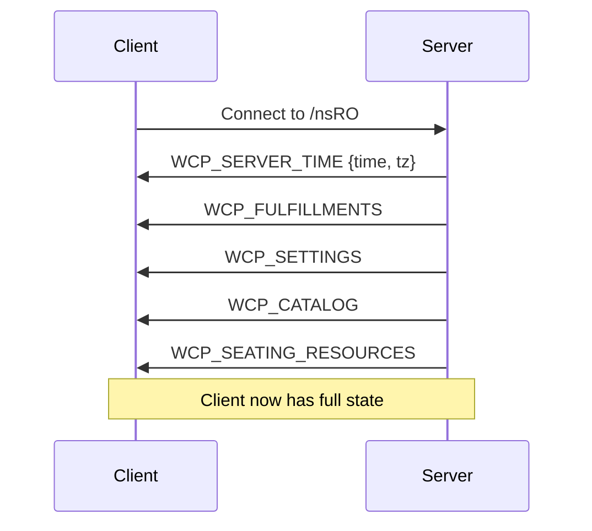
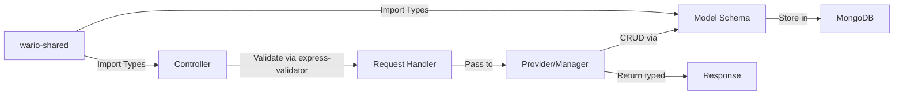
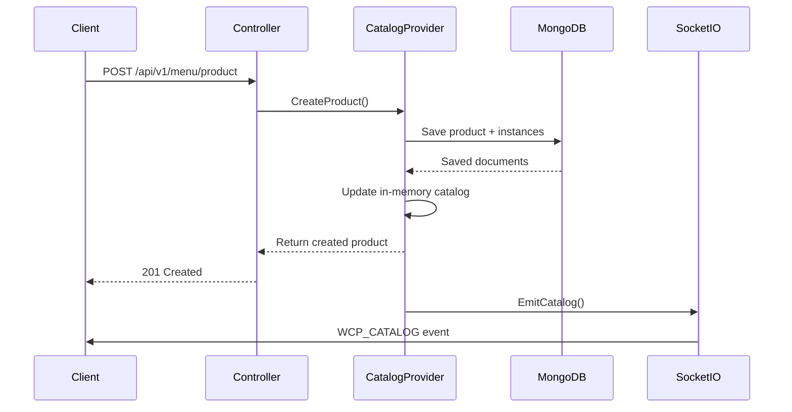
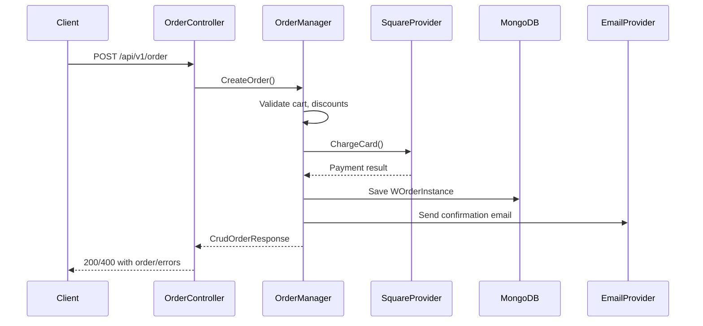

# wcp-order-backend Architecture Documentation

## Overview

`wcp-order-backend` is an Express.js + Socket.IO backend service for managing restaurant orders, catalog, fulfillment configuration, and payment processing. It uses MongoDB for persistence and integrates with external services (Square for payments, Google for email/calendar).

**Current Version**: 0.6.9  
**Main Entry Point**: `src/server.ts`  
**Framework**: Express.js with Socket.IO  
**Database**: MongoDB (via Mongoose 6.x)  
**Type System**: TypeScript with types derived from `@wcp/wario-shared`

---

## Application Architecture

### Initialization Flow



### Core Components

#### 1. **WApp Class** (`src/App.ts`)

The main application class that orchestrates the entire backend:

- **Express App**: HTTP server with CORS, JSON parsing (5MB limit), idempotency middleware
- **Socket.IO Server**: WebSocket server with two namespaces:
  - `nsRO` (Read-Only): Public namespace for broadcasting catalog data
  - `nsAUTH` (Authenticated) - currently unused but reserved for authenticated order updates
- **Provider Bootstrap**: Sequential initialization of all providers on MongoDB connection

**Middleware Stack**:
1. `express-idempotency` - Prevents duplicate operations
2. `cors` - CORS configuration for allowed origins
3. `express.json()` - JSON body parser (5MB limit)
4. `express-winston` - Request/response logging
5. Custom error middleware

#### 2. **Providers** (WProvider Interface)

Singleton services bootstrapped on startup:

| Provider | File | Responsibility |
|----------|------|----------------|
| **DatabaseManagerInstance** | `config/database_manager.ts` | Schema migrations, version management |
| **DataProviderInstance** | `config/dataprovider.ts` | Fulfillments, settings, seating resources, key-value config |
| **GoogleProviderInstance** | `config/google.ts` | Gmail API, Calendar API for email/event management |
| **SquareProviderInstance** | `config/square.ts` | Square payment processing, catalog sync |
| **CatalogProviderInstance** | `config/catalog_provider.ts` | In-memory catalog management, product/modifier CRUD |
| **SocketIoProviderInstance** | `config/socketio_provider.ts` | Socket.IO event broadcasting |
| **OrderManagerInstance** | `config/order_manager.ts` | Order lifecycle management, payment processing |

---

## REST API Documentation

### Base Path Structure

All endpoints are prefixed with `/api/v1/`

### Authentication & Authorization

- **JWT Authentication**: Uses `express-oauth2-jwt-bearer` with Auth0
- **Scopes**:
  - `read:orders` - View orders
  - `write:orders` - Modify orders
  - `cancel:orders` - Cancel orders
  - `write:catalog` - Modify catalog (products, modifiers, categories)
  - `delete:catalog` - Delete catalog items
  - `write:kvstore` - Modify key-value store
  - `write:orderconfig` - Modify order configuration
  - `edit:credit` - Issue store credit

### Controllers & Endpoints

#### 1. OrderController (`/api/v1/order`)

**Purpose**: Order lifecycle management

| Method | Endpoint | Auth | Request Body | Response | Description |
|--------|----------|------|--------------|----------|-------------|
| POST | `/api/v1/order` | Public | `CreateOrderRequestV2` | `CrudOrderResponse` | Submit new order |
| GET | `/api/v1/order/:oId` | JWT + `read:orders` | - | `WOrderInstance` | Get order by ID |
| GET | `/api/v1/order` | JWT + `read:orders` | Query: `date`, `status` | `WOrderInstance[]` | Query orders |
| PUT | `/api/v1/order/:oId/cancel` | JWT + `cancel:orders` | `reason`, `emailCustomer`, `refundToOriginalPayment` | `CrudOrderResponse` | Cancel order |
| PUT | `/api/v1/order/:oId/send` | JWT + `write:orders` | - | `WOrderInstance` | Send order to kitchen |
| PUT | `/api/v1/order/:oId/confirm` | JWT + `write:orders` | `additionalMessage` | `CrudOrderResponse` | Confirm order |
| PUT | `/api/v1/order/:oId/move` | JWT + `write:orders` | `destination`, `additionalMessage` | `CrudOrderResponse` | Move order to different station |
| PUT | `/api/v1/order/:oId/reschedule` | JWT + `write:orders` | `selectedDate`, `selectedTime`, `emailCustomer`, `additionalMessage` | `CrudOrderResponse` | Reschedule order |
| PUT | `/api/v1/order/unlock` | JWT + `write:orders` | - | `{ok: string}` | Obliterate all order locks |

**CreateOrderRequestV2 Schema**:
```typescript
{
  cart: OrderCartEntry[],
  proposedDiscounts: OrderLineDiscount[],
  proposedPayments: OrderPayment[],
  customerInfo: CustomerInfo,
  fulfillment: FulfillmentInfo,
  tip: TipSelection,
  specialInstructions?: string,
  metrics?: object
}
```

**Idempotency**: All PUT operations require `idempotency-key` header

#### 2. ProductController (`/api/v1/menu/product`)

**Purpose**: Product (menu item) management

| Method | Endpoint | Auth | Description |
|--------|----------|------|-------------|
| POST | `/api/v1/menu/product` | JWT + `write:catalog` | Create product class with instances |
| POST | `/api/v1/menu/productbatch` | JWT + `write:catalog` | Batch create/upsert products |
| PATCH | `/api/v1/menu/product/:pid` | JWT + `write:catalog` | Update product class |
| DELETE | `/api/v1/menu/product/:pid` | JWT + `delete:catalog` | Delete product class |
| POST | `/api/v1/menu/productbatch/batchDelete` | JWT + `delete:catalog` | Batch delete products |
| POST | `/api/v1/menu/product/:pid` | JWT + `write:catalog` | Create product instance |
| PATCH | `/api/v1/menu/product/:pid/:piid` | JWT + `write:catalog` | Update product instance |
| DELETE | `/api/v1/menu/product/:pid/:piid` | JWT + `delete:catalog` | Delete product instance |

**Product Structure**:
- **Product Class** (`IProduct`): Shared attributes (price, modifiers, categories)
- **Product Instance**: Specific variations (displayName, description, shortcode)

#### 3. ModifierController (`/api/v1/menu/option`)

**Purpose**: Modifier type and option management

| Method | Endpoint | Auth | Description |
|--------|----------|------|-------------|
| POST | `/api/v1/menu/option` | JWT + `write:catalog` | Create modifier type with options |
| PATCH | `/api/v1/menu/option/:mtid` | JWT + `write:catalog` | Update modifier type |
| DELETE | `/api/v1/menu/option/:mtid` | JWT + `delete:catalog` | Delete modifier type |
| POST | `/api/v1/menu/option/:mtid` | JWT + `write:catalog` | Create modifier option |
| PATCH | `/api/v1/menu/option/:mtid/:moid` | JWT + `write:catalog` | Update modifier option |
| DELETE | `/api/v1/menu/option/:mtid/:moid` | JWT + `delete:catalog` | Delete modifier option |

**Modifier Structure**:
- **Modifier Type** (`IOptionType`): Group of options (e.g., "Size", "Toppings")
- **Modifier Option** (`IOption`): Individual choice within a type

#### 4. CategoryController (`/api/v1/menu/category`)

**Purpose**: Menu category management

| Method | Endpoint | Auth | Description |
|--------|----------|------|-------------|
| POST | `/api/v1/menu/category` | JWT + `write:catalog` | Create category |
| PATCH | `/api/v1/menu/category/:catid` | JWT + `write:catalog` | Update category |
| DELETE | `/api/v1/menu/category/:catid` | JWT + `delete:catalog` | Delete category (optionally delete contained products) |

#### 5. FulfillmentController (`/api/v1/config/fulfillment`)

**Purpose**: Fulfillment service configuration (delivery, pickup, dine-in)

| Method | Endpoint | Auth | Description |
|--------|----------|------|-------------|
| POST | `/api/v1/config/fulfillment` | JWT + `write:catalog` | Create fulfillment config |
| PATCH | `/api/v1/config/fulfillment/:fid` | JWT + `write:catalog` | Update fulfillment config |
| DELETE | `/api/v1/config/fulfillment/:fid` | JWT + `delete:catalog` | Delete fulfillment config |

**FulfillmentConfig Schema**:
```typescript
{
  displayName: string,
  service: FulfillmentType, // DELIVERY, PICKUP, DINEIN
  leadTime: number, // minutes
  operatingHours: Record<DayOfWeek, Interval[]>,
  specialHours: KeyValue<string, Interval[]>[],
  blockedOff: KeyValue<string, Interval[]>[],
  requirePrepayment: boolean,
  allowTipping: boolean,
  serviceArea?: GeoJSON.Polygon // for delivery
  // ... more fields
}
```

#### 6. SettingsController (`/api/v1/config`)

**Purpose**: System settings and timing configuration

| Method | Endpoint | Auth | Description |
|--------|----------|------|-------------|
| POST | `/api/v1/config/timing/blockoff` | JWT + `write:orderconfig` | Add blocked-off time intervals |
| DELETE | `/api/v1/config/timing/blockoff` | JWT + `write:orderconfig` | Remove blocked-off time intervals |
| POST | `/api/v1/config/timing/leadtime` | JWT + `write:orderconfig` | Set lead times per fulfillment |
| POST | `/api/v1/config/settings` | JWT + `write:kvstore` | Update global settings |

#### 7. StoreCreditController (`/api/v1/payments/storecredit`)

**Purpose**: Gift card and store credit management

| Method | Endpoint | Auth | Description |
|--------|----------|------|-------------|
| GET | `/api/v1/payments/storecredit/validate` | Public | Validate and lock credit code |
| POST | `/api/v1/payments/storecredit/spend` | Public | Spend credit (requires lock) |
| POST | `/api/v1/payments/storecredit/purchase` | Public | Purchase gift card via Square |
| POST | `/api/v1/payments/storecredit/issue` | JWT + `edit:credit` | Issue store credit (refunds, promos) |

**Credit Flow**:
1. Client calls `/validate?code=xxx` → Returns balance + encrypted lock
2. Client submits order with lock in `proposedDiscounts`
3. Server validates lock and spends credit atomically

#### 8. AccountingController (`/api/v1/payments`)

**Purpose**: Reports and analytics

| Method | Endpoint | Auth | Description |
|--------|----------|------|-------------|
| GET | `/api/v1/payments/tips` | Public | Get tips for date (from Google Calendar) |
| GET | `/api/v1/payments/report` | Public | Daily sales report by category |

#### 9. DeliveryAddressController (`/api/v1/addresses`)

**Purpose**: Address validation for delivery

| Method | Endpoint | Auth | Description |
|--------|----------|------|-------------|
| GET | `/api/v1/addresses/validate` | Public | Validate address via Google Geocoding API, check if in delivery area |

**Other Controllers** (Minor):
- **KeyValueStoreController** (`/api/v1/config/keyvalue`) - Generic key-value storage
- **ProductInstanceFunctionController** - Conditional logic for product instances
- **PrinterGroupController** - Kitchen printer routing
- **SeatingResourceController** - Table/seating management (dine-in)

---

## Socket.IO API Documentation

### Namespace: `nsRO` (Read-Only - Public)

**Connection Flow**:


#### Server-to-Client Events

| Event | Payload | Trigger | Description |
|-------|---------|---------|-------------|
| `WCP_SERVER_TIME` | `{time: string, tz: string}` | On connection | Server time in ISO format + timezone |
| `WCP_FULFILLMENTS` | `Record<string, FulfillmentConfig>` | On connection, catalog updates | Available fulfillment services |
| `WCP_SETTINGS` | `IWSettings` | On connection, settings updates | Global settings |
| `WCP_CATALOG` | `ICatalog` | On connection, catalog updates | Complete product catalog |
| `WCP_SEATING_RESOURCES` | `Record<string, SeatingResource>` | On connection, seating updates | Available tables/seats |

**Catalog Structure** (`ICatalog`):
```typescript
interface ICatalog {
  categories: Record<string, ICategory>,
  modifiers: Record<string, ModifierEntry>, // {modifierType, options}
  products: Record<string, ProductEntry>    // {product, instances}
}
```

#### Client-to-Server Events

Currently none. The `nsRO` namespace is **broadcast-only**.

### Namespace: `nsAUTH` (Authenticated)

**Status**: Defined but **not actively used**. Reserved for future authenticated real-time order updates.

**Intended Use**:
- Real-time order status updates for authenticated POS clients
- JWT authentication via `@thream/socketio-jwt`

---

## MongoDB Store Architecture

### Connection Management

**Connection String**: `mongodb://{DBENDPOINT}/{DBTABLE}`  
**Environment Variables**:
- `DBENDPOINT` - MongoDB host:port (default: `127.0.0.1:27017`)
- `DBTABLE` - Database name
- `DBUSER`, `DBPASS` - Credentials (optional)

**Connection**: Established in `WApp.listen()` before provider bootstrapping

### Database Schema Versioning

**DatabaseManager** (`config/database_manager.ts`) handles schema migrations:

- **Version Storage**: `DBVersionSchema` collection stores current version
- **Migration Functions**: Defined in `UPGRADE_MIGRATION_FUNCTIONS` map
- **Migration Flow**: Sequential execution from current → target version
- **Current Version**: Tracked in `package.json` (`0.6.9`)

**Example Migration** (0.5.59):
```typescript
"0.5.59": [{ major: 0, minor: 5, patch: 60 }, async () => {
  // Add balance field to discounts
  // Move processorId from payment.processorId to top-level
  const allOrders = await WOrderInstanceSchema.find();
  // ... migration logic
}]
```

### Collections (Models)

#### 1. **Orders**

**Model**: `WOrderInstanceModel` (`models/orders/WOrderInstance.ts`)

**Schema** (`WOrderInstanceSchema`):
```typescript
{
  status: WOrderStatus, // PROPOSED, OPEN, CONFIRMED, CANCELED
  customerInfo: CustomerInfoSchema,
  fulfillment: FulfillmentInfoSchema,
  cart: [OrderCartEntrySchema],
  discounts: [WOrderLineDiscountSchema],
  payments: [WOrderPaymentSchema],
  refunds: [WOrderPaymentSchema],
  metrics: WMetricsSchema,
  taxes: [OrderTaxSchema],
  tip: TipSelectionSchema,
  metadata: [KeyValueEntrySchema],
  specialInstructions: string,
  locked: string // Lock ID for preventing concurrent modifications
}
```

**Sub-Schemas**:
- `CustomerInfoSchema` (`WCustomerInfo.ts`): Name, email, phone, referral
- `FulfillmentInfoSchema` (`WFulfillmentInfo.ts`): Service, date/time, status, address (if delivery)
- `OrderCartEntrySchema` (`WOrderCartEntry.ts`): Category ID, quantity, product w/ modifiers
- `WOrderPaymentSchema` (`payment/WOrderPayment.ts`): Payment method (card, credit), amount, tip, processor ID
- `WOrderLineDiscountSchema` (`payment/WOrderLineDiscount.ts`): Credit code, amount, encrypted lock

#### 2. **Catalog**

**Products**:

- **WProductModel** (`catalog/products/WProductSchema.ts`): Product class
  ```typescript
  {
    baseProductId: string, // ref to base product instance
    price: WMoney,
    disabled: {start: number, end: number}, // epoch times
    externalIDs: [KeyValueEntry],
    serviceDisable: [string], // fulfillment IDs
    modifiers: [ProductModifierSchema], // {mtid, enable, serviceDisable}
    category_ids: [string],
    displayFlags: {...},
    timing: PrepTimingSchema,
    availability: [RecurringIntervalSchema],
    printerGroup: string
  }
  ```

- **WProductInstanceModel** (`catalog/products/WProductInstanceSchema.ts`): Specific product variant
  ```typescript
  {
    displayName: string,
    description: string,
    shortcode: string,
    ordinal: number,
    externalIDs: [KeyValueEntry],
    modifiers: [ProductInstanceModifierSchema], // overrides
    displayFlags: {pos, menu, order}
  }
  ```

**Modifiers**:

- **WOptionTypeModel** (`catalog/options/WOptionTypeSchema.ts`): Modifier type
  ```typescript
  {
    name: string,
    displayName: string,
    ordinal: number,
    min_selected: number,
    max_selected: number,
    externalIDs: [KeyValueEntry],
    displayFlags: {modifier_class, template_string, ...}
  }
  ```

- **WOptionModel** (`catalog/options/WOptionSchema.ts`): Modifier option
  ```typescript
  {
    modifierTypeId: string,
    displayName: string,
    description: string,
    shortcode: string,
    price: WMoney,
    disabled: {start, end},
    ordinal: number,
    enable: string, // product instance function ID
    metadata: {flavor_factor, bake_factor, ...},
    displayFlags: {...},
    availability: [RecurringIntervalSchema],
    externalIDs: [KeyValueEntry]
  }
  ```

**Categories**:

- **WCategoryModel** (`catalog/category/WCategorySchema.ts`)
  ```typescript
  {
    name: string,
    description: string,
    subheading: string,
    footnotes: string,
    ordinal: number,
    parent_id: string,
    serviceDisable: [string],
    display_flags: {call_line_name, call_line_display, nesting}
  }
  ```

#### 3. **Configuration**

**Fulfillments**:

- **FulfillmentModel** (`query/FulfillmentSchema.ts`): Stored in MongoDB, loaded into `DataProviderInstance.Fulfillments`

**Settings**:

- **WSettingsModel** (`settings/SettingsSchema.ts`): Global settings, loaded into `DataProviderInstance.Settings`

**Key-Value Store**:

- **KeyValueModel** (`settings/KeyValueSchema.ts`): Generic configuration storage

**Seating Resources**:

- **SeatingResourceModel** (`orders/WSeatingResource.ts`): Tables, booths for dine-in

**Printer Groups**:

- **WPrinterGroupModel** (`catalog/WPrinterGroupSchema.ts`): Kitchen printer routing

#### 4. **Payments**

Store credit managed via external system (not MongoDB models shown in codebase).

---

## Type Derivation from `@wcp/wario-shared`

The backend **heavily relies** on type definitions from the `@wcp/wario-shared` package:

### Type Import Pattern

All models import types from `@wcp/wario-shared` and use them for:
1. **TypeScript type safety** in business logic
2. **Mongoose schema definitions** via type annotations
3. **Validation chain types** for express-validator

### Key Imported Types

**Order Types**:
- `WOrderInstance`, `WOrderStatus`, `WFulfillmentStatus`
- `CreateOrderRequestV2`, `CrudOrderResponse`
- `OrderTax`, `TipSelection`
- `TenderBaseStatus`, `PaymentMethod`, `DiscountMethod`

**Catalog Types**:
- `IProduct`, `IProductInstance`, `IProductDisplayFlags`
- `IOptionType`, `IOption`
- `ICategory`, `CALL_LINE_DISPLAY`, `CategoryDisplay`
- `MODIFIER_CLASS`, `DISPLAY_AS`, `OptionPlacement`, `OptionQualifier`

**Fulfillment Types**:
- `FulfillmentConfig`, `FulfillmentType`, `FulfillmentTime`

**Money & Payments**:
- `CURRENCY`, `IMoney` (custom schema: `WMoney`)
- `StoreCreditType`, `SpendCreditResponse`

**Utility Types**:
- `WDateUtils` - Date/time utilities
- `SEMVER` - Semantic versioning
- `KeyValue<K, V>` - Generic key-value pairs
- `RecurringInterval`, `PrepTiming`

### Custom Schema Wrappers

**WMoney** (`models/WMoney.ts`):
```typescript
// Mongoose schema for IMoney type
export const WMoney = new Schema<IMoney>({
  amount: { type: Number, required: true },
  currency: { type: String, required: true, enum: Object.values(CURRENCY) }
}, { _id: false });
```

This pattern is repeated for:
- `IntervalSchema` → from `Interval`
- `PrepTimingSchema` → from `PrepTiming`
- `RecurringIntervalSchema` → from `RecurringInterval`

### Validation Integration

Express-validator chains validate against `wario-shared` types:

```typescript
// Example: Ensures body matches CreateOrderRequestV2 structure
body('fulfillment.status').equals(WFulfillmentStatus.PROPOSED), // from wario-shared
body('fulfillment.selectedService').isMongoId(),
body('proposedPayments.*.t').isIn([PaymentMethod.CreditCard, PaymentMethod.StoreCredit]) // from wario-shared
```

### Type Flow



**Key Insight**: The backend acts as a **persistence and business logic layer** for types defined in `wario-shared`. There are **no type redefinitions** - the backend trusts the shared package as the source of truth.

---

## Data Flow Patterns

### Catalog Updates



**Pattern**: All catalog mutations:
1. Persist to MongoDB
2. Update `CatalogProviderInstance.Catalog` in-memory cache
3. Broadcast via Socket.IO to all connected clients

### Order Submission



---

## Key Design Patterns

### 1. **Provider Singleton Pattern**

All major services are singletons exported as instances:
```typescript
export const CatalogProviderInstance = new CatalogProvider();
export const OrderManagerInstance = new OrderManager();
```

### 2. **In-Memory Caching**

`CatalogProvider` and `DataProvider` maintain in-memory state:
- **Catalog**: All products, modifiers, categories cached at startup
- **Fulfillments**: Loaded and synced on updates
- **Settings**: Cached, emitted on changes

**Rationale**: Fast read access, broadcast changes via Socket.IO

### 3. **Idempotency for Mutations**

Order mutations use `express-idempotency` + `idempotency-key` header:
- Prevents duplicate charges/cancellations
- Stores completed operations in MongoDB adapter

### 4. **Lock-based Concurrency**

**Store Credit**: Encrypted locks prevent double-spending
**Orders**: `locked` field prevents concurrent modifications

### 5. **Type-Driven Development**

All schemas derive from `@wcp/wario-shared` types, ensuring:
- Frontend and backend use identical types
- No type drift between systems
- Shared validation logic

---

## External Integrations

| Service | SDK | Usage |
|---------|-----|-------|
| **Square** | `square` npm package | Payment processing, catalog sync |
| **Google Gmail API** | `googleapis` | Order confirmation emails, error alerts |
| **Google Calendar API** | `googleapis` | Tip tracking via calendar events |
| **Google Maps Geocoding** | `@googlemaps/google-maps-services-js` | Address validation for delivery |

---

## Environment Configuration

Required environment variables:

```bash
TZ=America/Los_Angeles        # Timezone (required, fails on startup if missing)
PORT=4001                      # HTTP server port
DBTABLE=wario                  # MongoDB database name
DBUSER=...                     # MongoDB username
DBPASS=...                     # MongoDB password
DBENDPOINT=127.0.0.1:27017    # MongoDB host:port

# External service keys (loaded from DataProvider.KeyValueConfig)
EMAIL_ADDRESS=...              # Google email sender
GOOGLE_GEOCODE_KEY=...        # Google Maps API key
```

---

## Client State Synchronization

### Initial Load

1. Client connects to Socket.IO `nsRO` namespace
2. Server immediately emits:
   - `WCP_SERVER_TIME` - Server timestamp + timezone
   - `WCP_FULFILLMENTS` - All fulfillment services
   - `WCP_SETTINGS` - Global settings
   - `WCP_CATALOG` - Complete product catalog
   - `WCP_SEATING_RESOURCES` - Tables/seating (if dine-in)

### Live Updates

When catalog/fulfillment/settings change via REST API:
- Server persists to MongoDB
- Server broadcasts to all connected Socket.IO clients
- Clients update local state without polling

**Result**: Real-time menu updates across all client apps (POS, online ordering, kiosks)

---

## Migration Considerations for NestJS

### Current Architecture Highlights

1. **Express Controllers** → Map to NestJS Controllers
2. **Provider Pattern** → Map to NestJS Services (already singleton-like)
3. **Mongoose Models** → Can reuse with `@nestjs/mongoose`
4. **Socket.IO Namespaces** → Use `@nestjs/platform-socket.io`
5. **JWT Auth** → Map to NestJS Guards with `@nestjs/passport`
6. **Validation** → Replace `express-validator` with `class-validator` DTOs
7. **Middleware** → Map to NestJS Middleware/Interceptors
8. **Bootstrap Flow** → Map to NestJS `OnModuleInit` lifecycle hooks

### Compatibility Requirements

For a **zero-disruption migration**, the NestJS implementation must maintain:

1. **Identical REST API contracts** (all endpoints, validation rules)
2. **Identical Socket.IO event names and payloads**
3. **Same MongoDB schema/collection names**
4. **Same external service integrations** (Square, Google APIs)
5. **Idempotency behavior** for order mutations
6. **JWT scope-based authorization** matching current scopes

### Type Safety Advantage

The heavy reliance on `@wcp/wario-shared` types is a **major advantage**:
- NestJS DTOs can directly import and `extends` these types
- `class-transformer` + `class-validator` can validate against the same types
- No client code changes needed if types remain the source of truth
